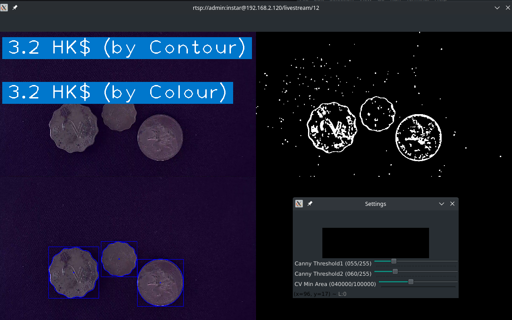

# OpenCV Count My Money

Differentiate Objects based on their Contours and Colors with OpenCV, cvZone and an INSTAR IP Camera. This is based on Murtaza's Workshop - Robotics and AI:

1. Get your Cameras RTSP Stream into OpenCV
2. Use cvZone to detect object contours and process them
3. Use cvZone to remove non-matching colours to isolate/identify objects.

